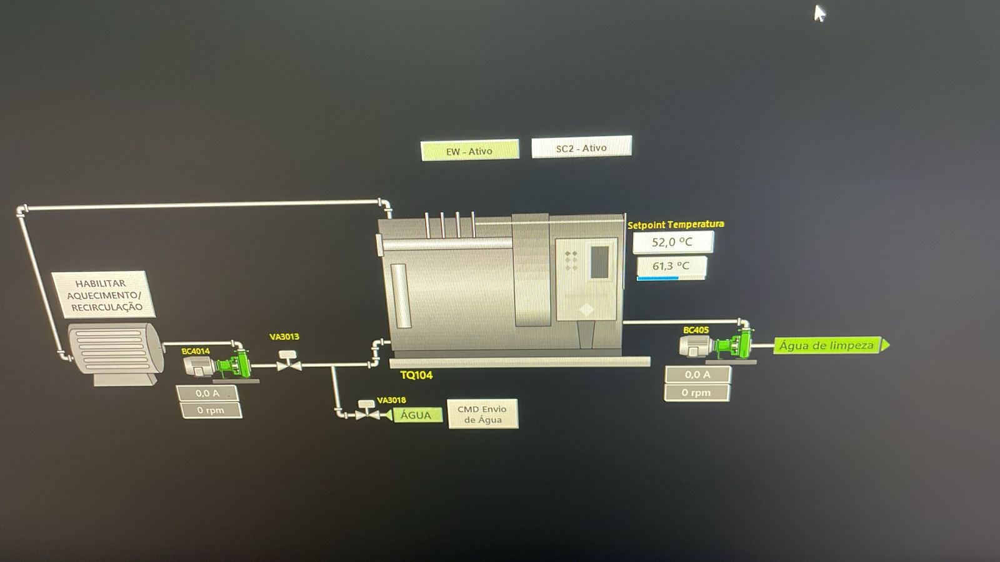
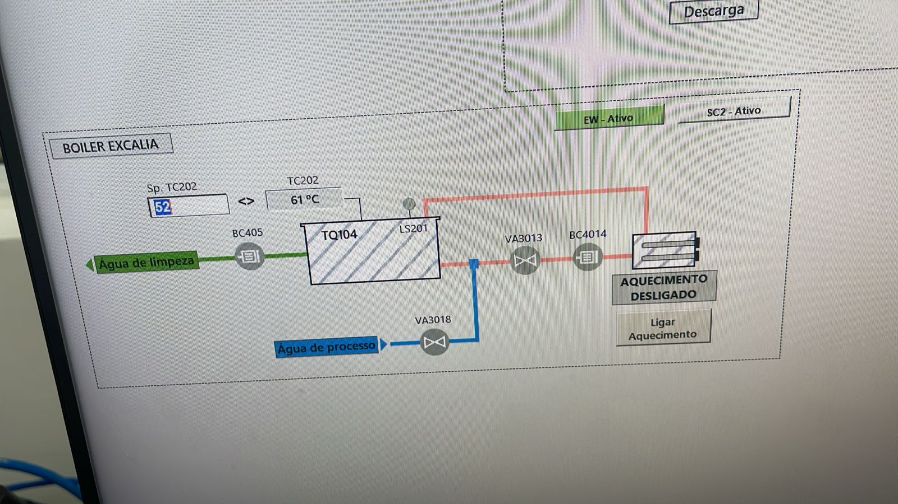

# Relatório Diário de Ocorrências (RDO)

**Data:** 13 de fevereiro de 2026 (Sexta-feira)  
**Responsável:** Diogo Moura  
**Empresa:** Sumitomo Chemical  
**Período:** Integral

---

## Atividades Realizadas

### 1. SC2/EW | Finalização da integração de comunicação - Sistema Boiler

**Área:** SC2 / EW - Comunicação entre plantas  
**Planta/Equipamento:** Sistema de Boiler - Messages (blocos lógicos Rockwell)  
**Tipo de Atividade:** Desenvolvimento / Integração  

**Descrição:** Retomada e finalização completa do mapeamento de endereços e implementação da comunicação entre o CLP do SC2 (Boiler) e o CLP do EW, permitindo leitura e escrita de comandos através do EW.

**Contexto:**
- Continuidade do trabalho de mapeamento iniciado em dias anteriores
- Objetivo: habilitar comandos no EW para controle do sistema Boiler localizado no SC2
- Integração multi-plantas para centralização de controle

**Atividades desenvolvidas:**
- Retomada do mapeamento de endereços
- Finalização do mapeamento completo
- Apontamento de todos os endereços necessários
- Implementação dos blocos de comunicação (messages)
- Testes de comunicação entre CLPs
- Validação de leitura de dados
- Validação de escrita de comandos
- Ajuste de intertravamentos
- Validação operacional completa

**Resultado:**
- ✅ Mapeamento de endereços concluído
- ✅ Comunicação SC2 → EW estabelecida e validada
- ✅ Comandos do EW → SC2 funcionando corretamente
- ✅ Leitura de dados do SC2 no EW operacional
- ✅ Intertravamentos ajustados e validados
- ✅ Sistema integrado e operacional

**Status:** ✅ Concluído

**Período:** Integral

**Evidências:**

| Imagem | Descrição |
|---|---|
|  | Tela do supervisório mostrando o sistema Boiler com EW ativo (verde), indicando que o controle está sendo realizado através da planta EW. Setpoint de temperatura em 52°C e temperatura atual em 61,3°C. |
|  | Tela do supervisório mostrando o sistema Boiler Excalia com hierarquia de controle implementada: quando EW está ativo, os comandos do aquecimento são enviados através do EW; quando SC2 está ativo, os comandos são locais. Válvulas VA3013 e VA3018 controlam água de limpeza e água de processo respectivamente. |

**Observações:
- Integração multi-plantas concluída com sucesso
- EW agora consegue ler e escrever no sistema Boiler do SC2
- Centralização de controle implementada
- Intertravamentos ajustados garantem segurança operacional
- Sistema testado e validado em operação

---

## Resumo do Dia

**Total de atividades:** 1  
**Atividades concluídas:** 1  
**Atividades em andamento:** 0  

**Áreas atendidas:**
- SC2/EW - Comunicação entre plantas (1 atividade)

**Destaques:**
- Finalização da integração SC2/EW (sistema Boiler)
- Comunicação multi-plantas estabelecida e validada
- Centralização de controle implementada com sucesso

---

## Observações Gerais

- Dia com foco exclusivo em finalização da integração multi-plantas
- Trabalho de mapeamento e implementação concluído com sucesso
- Sistema de comunicação SC2/EW operacional e validado
- Integração permite controle centralizado do sistema Boiler através do EW
- Intertravamentos ajustados garantem operação segura
- Projeto de integração multi-plantas finalizado

---

## Próximos Passos

- Monitorar funcionamento da integração SC2/EW em operação
- Disponibilizar suporte técnico para ajustes operacionais se necessário
- Documentar lições aprendidas para futuras integrações

---

**Relatório gerado em:** 13/02/2026  
**Assinatura Digital:** Diogo Moura
