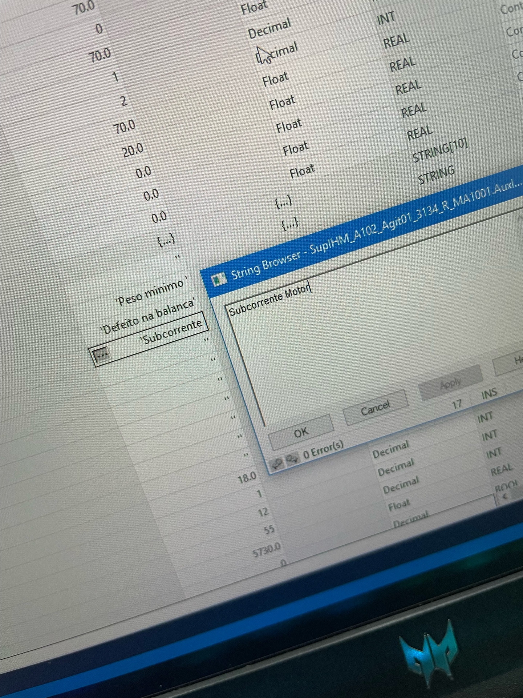
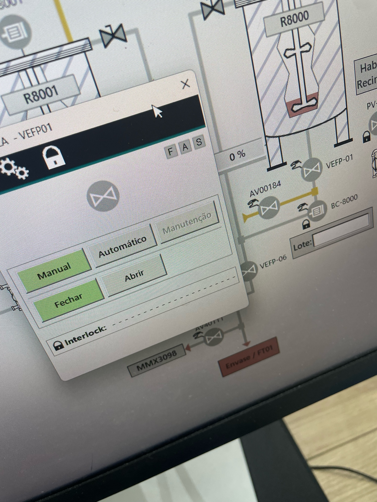

# Relatório Diário de Ocorrências (RDO)

**Data:** 25 de Fevereiro de 2026
**Responsável:** Diogo Moura

---

## Resumo das Atividades

O dia foi focado na implementação de melhorias e intertravamentos de segurança em duas áreas críticas da planta: **Herbicidas 3 (H3)** e **Emulsão (EW)**. As atividades foram solicitadas pelas equipes de manufatura para aumentar a segurança operacional e otimizar processos.

### 1. Implementação de 27 Intertravamentos de Corrente (Herbicidas 3)

**Solicitante:** Natália (Manufatura - H3)

Foi realizado o levantamento e a implementação de uma nova lógica de proteção para **27 motores** (bombas de transferência e agitadores) na planta de Herbicidas 3. O objetivo foi criar um sistema de segurança que monitora a corrente dos motores para detectar condições de subcorrente, indicativas de operação anormal.

Para isso, foi desenvolvida uma instrução **Add-On (AOI)** customizada, `BreakOpr_Motor_v2`, que centraliza a lógica de monitoramento. Esta AOI lê continuamente o status e a corrente do motor, gerando um alarme e incrementando um contador de eventos sempre que uma condição de falha (baseada em setpoint e tempo) é detectada. O bit de alarme gerado pela AOI foi integrado à estrutura de interlocks do motor, garantindo a parada segura do equipamento e fornecendo uma mensagem clara ao operador sobre a causa da falha.

As lógicas foram implementadas e testadas, porém se encontram **bloqueadas**, aguardando a definição dos parâmetros finais (valor de corrente e tempo) e a autorização formal para liberação da melhoria.

| Imagem | Descrição |
|---|---|
|  | Lógica de controle do agitador, mostrando a integração do alarme de subcorrente (`AlmLatched`) na cadeia de intertravamento. |
|  | Detalhe da Add-On `BreakOpr_Motor_v2` aplicada a dois motores, exibindo os parâmetros de status, corrente e contagem de falhas. |
|  | Configuração da mensagem de alarme "Subcorrente Motor" que é exibida ao operador no sistema supervisório. |

### 2. Otimização do Controle de Processo (Reator 3098 - EW)

**Solicitante:** Gfter (Manufatura)

Foram implementadas duas melhorias no controle do **Reator 3098** para otimizar os processos de reciclo e transferência.

- **Processo de Reciclo:** Foi criada uma condição que, ao iniciar o reciclo, envia um pulso para a bomba, permitindo que sua velocidade seja ajustada para **150 RPM**. Essa alteração elimina a necessidade de ajuste manual pelo operador e mantém a flexibilidade de controle do setpoint durante o processo.

- **Processo de Transferência:** A lógica foi ajustada para garantir que, durante a transferência, a velocidade da bomba seja fixada em **22 RPM**, sem possibilidade de alteração manual, assegurando a conformidade com os parâmetros de segurança do processo.

### 3. Intertravamento de Segurança: Válvulas de Fundo × Nitrogênio (EW)

**Solicitante:** Gfter (Manufatura)

Em resposta a um incidente de transbordo, foi implementado um intertravamento de segurança nos reatores **R8000, R8001, R8002 e R8003**. A nova lógica impede a abertura da válvula de admissão de nitrogênio caso a válvula de fundo do respectivo reator esteja aberta.

Essa medida de segurança crítica previne que a pressurização com nitrogênio ocorra em um reator aberto, eliminando o risco de transbordamento de produto e garantindo um ambiente de trabalho mais seguro.

| Imagem | Descrição |
|---|---|
|  | Tela do supervisório mostrando a válvula de nitrogênio (AV00184) intertravada com a mensagem "Interlock: Valv. Fundo Aberta". |
|  | Detalhe do faceplate da válvula, indicando o status de intertravamento ativo (cadeado fechado). |

---

## Pendências

- Aguardando definição de parâmetros (corrente e tempo) e autorização formal para liberar os intertravamentos de subcorrente no H3.
